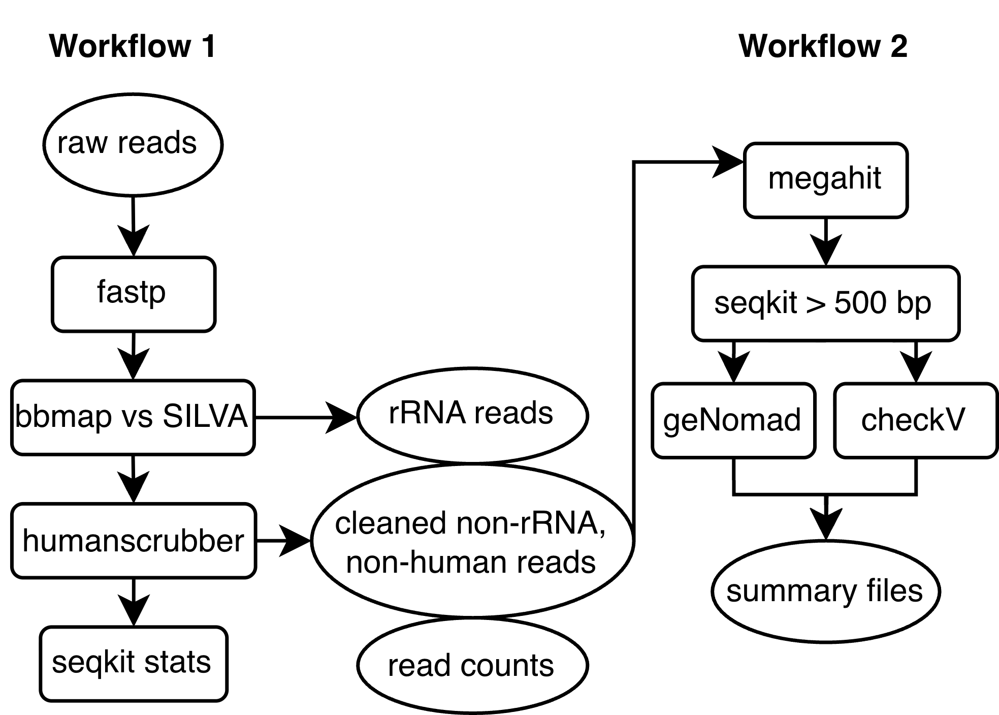
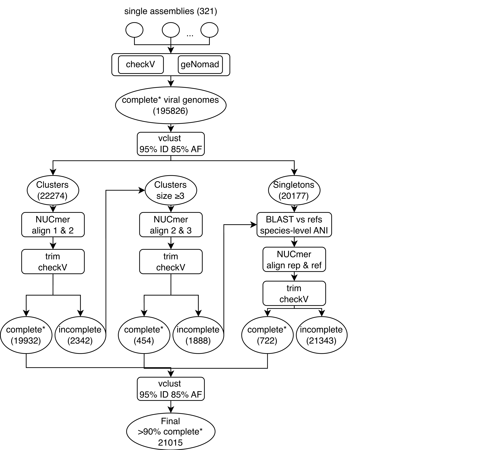

# wastewater_virus

This repo provides nextflow workflows for processing deep metagenomic sequencing of wastewater viruses.

## Workflow 1: Read-preprocessing
* read trimming and adapter removal with fastp
* ribosomal RNA read removal with bbduk
* human read removal with NCBI SRA humanscrubber
* read statistics with seqkit stats

## Workflow 2: Assembly and postprocessing
* reads are assembled into contigs with MEGAHIT
* contigs are filtered by length to >500 bp and renamed, then additionally filtered to >2000
* contigs are determined to be viral and viral genome quality is determined by CheckV
* contigs are separately determined to be viral/plasmid/integrated phage by geNomad



## Workflow 3: Generating a deduplicated database of viral genomes
* near-complete viral genomes are selected from workflow 2 outputs
* genomes are clustered to 95% identity and 85% alignment coverage with vclust
* cluster centroid genomes are trimmed to remove sequences possibly resulting from misassemblies
    * the centroid is aligned to another cluster member or to a reference sequence with nucmer
    * the nucmer alignment is converted to bed format and trimming uses seqkit
    * after trimming, genome completeness is again determined by CheckV
* near-complete genomes are re-clustered with vclust to remove duplicates



## Installation
* These workflows are intended to be run as-is and are not currently portable
* These workflows require the micromamba environment: envs/preprocessing.yml
* The path to this environment is currently hard-coded within the main and config files
* The paths to reference databases are also currently hard-coded
* Workflow 3: adjust params_wf3.sh to include paths to relevant directories and databases

### Setup
* Within each config, add the required tools, databases, and CPUs specific to your system
* In main_wf2.nf, change the megahit path to your megahit installation

### Dependencies for workflow3
Please ensure the following are in your path (versions included for reference): 
* seqkit v2.9.0
* vclust v1.3.1
* blastn v2.16.0+
* checkv v1.0.3
* nucmer v4.0.1

## Usage
* These workflows are written for slurm. If using flux, adjust as needed
* To process a batch of samples, edit the appropriate config file to provide the batch name as the param "sample"
* Batch name should correspond to a directory containing the following:
    * concat/ (the raw reads files, concatenated by sample if not previously performed)
    * processed/ (empty directory to store output from workflow1)
    * assembly/ (empty directory to store output from workflow2)

### Expected directory structure after running workflows 1 and 2
```text
fastq/
|-- batch1/
|   |-- concat/
|   |-- processed/
|   |   `-- sample1/
|   |       |-- sample1_clean.html
|   |       |-- sample1_no_rrna_final_reads.fastq.gz
|   |       |-- sample1_combined_stats.txt
|   |       `-- sample1_rrna.fastq.gz
|   `-- assembly/
|       `-- sample1/
|           |-- checkv_out/
|           |   |-- proviruses.fna
|           |   |-- quality_summary.tsv
|           |   `-- viruses.fna
|           |-- sample1.contigs.fa
|           |-- sample1_min2000.fa
|           |-- sample1_min500.fa
|           `-- sample1_summary/
|               |-- sample1_min500_virus_proteins.faa
|               |-- sample1_min500_virus.fna
|               `-- sample1_min500_virus_summary.tsv
```


Launch as

`nextflow run main_wf1.nf -c nextflow_wf1.config -with-trace`  
`nextflow run main_wf2.nf -c nextflow_wf2.config -with-trace`  
`sbatch wf3.sh params_wf3.sh`

Notes:
* confirm the read names match the pattern specified in the workflow1.config file; adjust as needed
* adjust the threads, nodes used, and time limits as needed in config files prior to running
* fastq files produced by workflow1 are automatically gzipped
* hardlinks are created in workflow1 so that outputs can be accessed from both the work directory and the publishDir, avoiding timeouts due to attempts to copy large files
* workflow3 is currently a bash script that may be updated to nextflow. For now, please review the dependencies described in the script and update as necessary to run.

## Authors
These workflows were created by Nelson Ruth, Rose Kantor, and Migun Shakya as part of the interlab LDRD on wastewater sequencing-based surveillance for early warning.
Funding was also provided to Rose Kantor by Inkfish, via the University of Missouri.

## Project status
This project aims to produce a database of viral genomes from wastewater that is iteratively updated and publicly available.

### Future updates

### LANL Copyright reference: O5111
